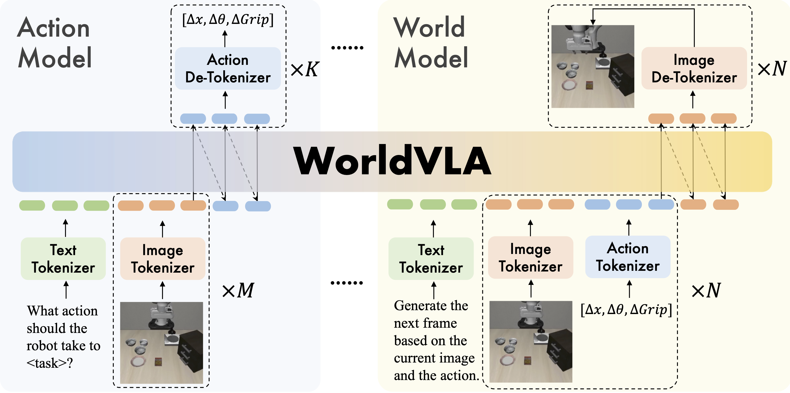
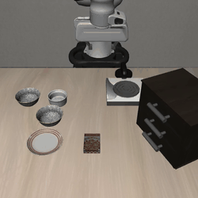

<p align="center">
    
<p>

<h3 align="center"><a href="https://arxiv.org/pdf/2506.21539" style="color:#9C276A">
WorldVLA: Towards Autoregressive Action World Model</a></h3>
<h5 align="center"> If our project helps you, please give us a star ⭐ on GitHub to support us. 🙏🙏 </h2>


<h5 align="center">

[](https://arxiv.org/pdf/2506.21539) 
[](https://huggingface.co/Alibaba-DAMO-Academy/WorldVLA)
[](./LICENSE) 
</h5>

## 📰 News

* **[2025.06.23]**  Release models, training code and evaluation code on LIBERO action generation benchmark of WorldVLA.

## 🌟 Introduction
WorldVLA is an autoregressive action world model that unifies action and image understanding and generation. WorldVLA intergrates Vision-Language-Action (VLA) model (action model) and world model in one single framework.

<div style="text-align: center;">
  
</div>
<br>

### Action Model Results (Text + Image -> Action)
Action Model generates actions given the text instruction and image observations.

<table>
  <tr>
    <td width="300">
      
    </td>
    <td width="300">
      
    </td>
    <td width="300">
      
    </td>
  </tr>
  <tr>
    <td><center>Input: Open the middle drawer of the cabinet.</center></td>
    <td><center>Input: Pick up the alphabet soup and place it in the basket.</center></td>
    <td><center>Input: Pick up the black bowl between the plate and the ramekin and place it on the plate.</center></td>
  </tr>
</table>

### World Model Results (Action + Image -> Image)
World Model generates the next frame given the current frame and action control.

<table>
  <tr>
    <td width="300" align="center">
      
    </td>
    <td width="300" align="center">
      
    </td>
    <td width="300" align="center">
      
    </td>
  </tr>
  <tr>
    <td align="center">
      Input: Action sequence of "Open the top drawer and put the bowl inside".
    </td>
    <td align="center">
      Input: Action sequence of "Push the plate to the front of the stove".
    </td>
    <td align="center">
      Input: Action sequence of "Put the bowl on the stove".
    </td>
  </tr>
</table>

## 🛠️ Requirements and Installation
```
conda env create -f environment.yml
git clone https://github.com/Lifelong-Robot-Learning/LIBERO.git
cd LIBERO
pip install -e .
```

## :earth_americas: Model Zoo

| Model (256 * 256)    |    HF Link        |    Success Rate (%)     |
| :--------------------: | :------------------------------------------------------------: | :--------------------: |
| LIBERO-Spatial       | [Alibaba-DAMO-Academy/WorldVLA/model_256/libero_spatial](https://huggingface.co/Alibaba-DAMO-Academy/WorldVLA/tree/main/model_256/libero_spatial) | 85.6 |
| LIBERO-Object       | [Alibaba-DAMO-Academy/WorldVLA/model_256/libero_object](https://huggingface.co/Alibaba-DAMO-Academy/WorldVLA/tree/main/model_256/libero_object) | 89.0 |
| LIBERO-Goal | [Alibaba-DAMO-Academy/WorldVLA/model_256/libero_goal](https://huggingface.co/Alibaba-DAMO-Academy/WorldVLA/tree/main/model_256/libero_goal) | 82.6 |
| LIBERO-Long | [Alibaba-DAMO-Academy/WorldVLA/model_256/libero_10](https://huggingface.co/Alibaba-DAMO-Academy/WorldVLA/tree/main/model_256/libero_10) | 59.0 |
<br>

| Model (512 * 512)    |    HF Link        |    Success Rate (%)     |
| :--------------------: | :------------------------------------------------------------: | :--------------------: |
| LIBERO-Spatial       | [Alibaba-DAMO-Academy/WorldVLA/model_512/libero_spatial](https://huggingface.co/Alibaba-DAMO-Academy/WorldVLA/tree/main/model_512/libero_spatial) | 87.6 |
| LIBERO-Object       | [Alibaba-DAMO-Academy/WorldVLA/model_512/libero_object](https://huggingface.co/Alibaba-DAMO-Academy/WorldVLA/tree/main/model_512/libero_object) | 96.2 |
| LIBERO-Goal | [Alibaba-DAMO-Academy/WorldVLA/model_512/libero_goal](https://huggingface.co/Alibaba-DAMO-Academy/WorldVLA/tree/main/model_512/libero_goal) | 83.4 |
| LIBERO-Long | [Alibaba-DAMO-Academy/WorldVLA/model_512/libero_10](https://huggingface.co/Alibaba-DAMO-Academy/WorldVLA/tree/main/model_512/libero_10) | 60.0 |


## 🗝️ Training

### Step 1: Libero Data Preparation

We evaluate four tasks of the LIBERO benchmark, including [spatial, obejct, goal, 10], and 2 image resolutions, including [256, 512]. Here we take LIEBRO goal and 256 resolution as an example.

First, filter the no-operation actions like [OpenVLA](https://github.com/openvla/openvla).
```
cd worldvla/libero_util
python regenerate_libero_dataset_filter_no_op.py \
    --libero_task_suite libero_goal \
    --libero_raw_data_dir ../processed_data/Libero/libero_goal \
    --libero_target_dir ../processed_data/libero_goal_no_noops_t_256 \
    --image_resolution 256
```
Then, save all images and actions.
```
python regenerate_libero_dataset_save_img_action.py \
    --libero_task_suite libero_goal \
    --raw_data_dir ../processed_data/libero_goal_no_noops_t_256 \
    --save_dir ../processed_data/libero_goal_img_action_256
``` 
Next, generate the conversations data for the Chameleon model. The action model conversations are in the following format:
```json
{
  "conversations": [
    {
      "from": "human",
      "value": "What action should the robot take to open the middle drawer of the cabinet?<|image|><|image|>"
    },
    {
      "from": "gpt",
      "value": "<|action|><|action|><|action|><|action|><|action|>"
    }
  ],
  "image": [
    "../processed_data/libero_goal_img_action_256/open_the_middle_drawer_of_the_cabinet/trj_0/imgs/image_0.png",
    "../processed_data/libero_goal_img_action_256/open_the_middle_drawer_of_the_cabinet/trj_0/imgs/image_1.png"
  ],
  "action": [
    "../processed_data/libero_goal_img_action_256/open_the_middle_drawer_of_the_cabinet/trj_0/action/action_1.npy",
    "../processed_data/libero_goal_img_action_256/open_the_middle_drawer_of_the_cabinet/trj_0/action/action_2.npy",
    "../processed_data/libero_goal_img_action_256/open_the_middle_drawer_of_the_cabinet/trj_0/action/action_3.npy",
    "../processed_data/libero_goal_img_action_256/open_the_middle_drawer_of_the_cabinet/trj_0/action/action_4.npy",
    "../processed_data/libero_goal_img_action_256/open_the_middle_drawer_of_the_cabinet/trj_0/action/action_5.npy"
  ]
}
```
The world model conversations are in the following format:
```json
{
  "conversations": [
      {
          "from": "human",
          "value": "Generate the next image based on the provided sequence of historical images and corresponding actions.<|image|><|action|>"
      },
      {
          "from": "gpt",
          "value": "<|image|>"
      }
  ],
  "image": [
      "../processed_data/libero_goal_img_action_256/open_the_middle_drawer_of_the_cabinet/trj_5/imgs/image_0.png",
      "../processed_data/libero_goal_img_action_256/open_the_middle_drawer_of_the_cabinet/trj_5/imgs/image_1.png"
  ],
  "action": [
      "../processed_data/libero_goal_img_action_256/open_the_middle_drawer_of_the_cabinet/trj_5/action/action_0.npy"
  ]
},
```
To validate the world model performance, we split all the libero dataset into train/val_ind/val_ood json files.
```
cd worldvla/data
python action_model_conv_generation.py \
    --base_dir ../processed_data/libero_goal_img_action_256 \
    --his 2 \
    --len_action 5 \
    --task_name goal \
    --resolution 256 \
    --output_dir ../processed_data/convs
python world_model_conv_generation.py \
    --base_dir ../processed_data/libero_goal_img_action_256 \
    --his 1 \
    --task_name goal \
    --resolution 256 \
    --output_dir ../processed_data/convs
```
Finally, tokenize all the conversations into tokens and save them.
```
cd worldvla/data
python pretoken.py --task goal --resolution 256
./concate_record.sh
python concate_action_world_model_data.py --task goal --resolution 256
```

### Step 2: Prepare data configs
Set the correct data path in the config files in `worldvla/configs/libero_256_all`, `worldvla/exps_512_all`.

### Step 3: Start training
Now you can start training with your training scripts:
```bash
# Libero goal, 256 resolution
cd worldvla/exps_256_all
bash 7B_ts_his_2_img_only_goal_ck_5_1a2i_all.sh
# Libero goal, 512 resolution
cd worldvla/exps_512_all
bash 7B_ts_his_2_img_only_goal_ck_5_1a2i_all.sh
```

## ✅ Evaluation
### Step 1: Prepare evaluation scripts
Set the `--resume_path` in `worldvla/exps_256_all/eval_libero_7B_2_action_all_epochs_img_only_ck_5_1a2i_goal.sh` to the model path. You can download our trained in Model Zoo or train yourself.

### Step 2: Start evaluation
```bash
# Libero goal, 256 resolution
cd worldvla/exps_256_all
bash eval_libero_7B_2_action_all_epochs_img_only_ck_5_1a2i_goal.sh
# Libero goal, 512 resolution
cd worldvla/exps_512_all
bash eval_libero_7B_2_action_all_epochs_img_only_ck_5_1a2i_goal.sh
```

## 📆 TODO <a name="todos"></a>
- [x] Release the code of action model on LIBERO benchmark.
- [ ] Release the code of world model on LIBERO dataset.
- [ ] Release the code of real-world expriment.

## License <a name="license"></a>

All assets and code are under the [Apache 2.0 license](./LICENSE) unless specified otherwise.

## Citation <a name="citation"></a>
If you find the project helpful for your research, please consider citing our paper:
```bibtex
@article{cen2025worldvla,
  title={WorldVLA: Towards Autoregressive Action World Model},
  author={Cen, Jun and Yu, Chaohui and Yuan, Hangjie and Jiang, Yuming and Huang, Siteng and Guo, Jiayan and Li, Xin and Song, Yibing and Luo, Hao and Wang, Fan and others},
  journal={arXiv preprint arXiv:2506.21539},
  year={2025}
}
```

## Acknowledgment <a name="acknowledgment"></a>
This project builds upon [Lumina-mGPT](https://github.com/Alpha-VLLM/Lumina-mGPT), [Chemeleon](https://github.com/facebookresearch/chameleon), and [OpenVLA](http://github.com/openvla/openvla). We thank these teams for their open-source contributions.
